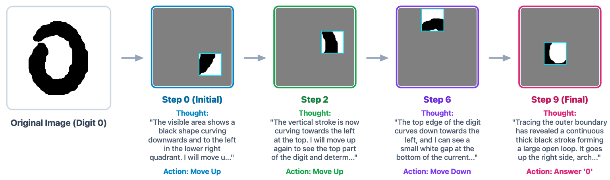

<h1 align="center">
    MNIST-PRO: MNIST is Back as a Partially Observable World for AI Agents
</h1>

<p align="center">
  <b>Vernon Toh</b><sup>1,2</sup>, <b>Navonil Majumder</b><sup>1</sup>, <b>Zhengyuan Liu</b><sup>2</sup>, <b>Nancy F. Chen</b><sup>2</sup>, <b>Soujanya Poria</b><sup>1</sup>
</p>
<p align="center">
  <sup>1</sup>DeCLaRe Lab, Nanyang Technological University, Singapore<br>
  <sup>2</sup>Agency for Science, Technology, and Research (A*STAR), Singapore
</p>
<p align="center">
  <a href="https://arxiv.org/abs/2608.31022"><b>[📄 Paper]</b></a>
</p>

## 📖 Overview
> **MNIST-PRO** is a controlled evaluation benchmark designed to isolate and evaluate the agentic perception capabilities of multimodal models. By converting MNIST digit recognition into a sequential, glimpse-based search task under partial observability, it forces agents to coordinate active visual sensing with working memory to construct and update an evolving perceptual state of the environment. To systematically analyze spatial tracking, visual integration, and sequential memory limits, the benchmark introduces lookback constraints and hierarchical task horizons (Single-Digit and Multi-Digit sequences) across diverse state representations, exposing the critical gap between passive visual recognition and active stateful perception.

<p align="center">
    
</p>


<p align="center">
    
</p>

## 🛠️ Environmental Setup

```bash
pip install -e ".[dev,data,models,analysis]"
```

Credentials are read from the environment and never written to a file:

```bash
export GEMINI_API_KEY=...
```

## 🚀 Usage

### ⚡ Quickstart

Run one condition:

```bash
mnist-pro run --model gemini-3.7-flash --digits 1
```

Summarise a directory of runs:

```bash
mnist-pro analyse --results-dir results --csv results.csv
```

See which harnesses can run on this machine:

```bash
mnist-pro harness
```

### 🔌 Tool-Use & MCP Harnesses

MNIST-PRO supports evaluating agents via Model Context Protocol (MCP) tool-use harnesses rather than simple turn-based interactions. The benchmark supports three evaluation **arms** across episodes:
* `A0`: No information is carried between episodes.
* `A1`: A persistent markdown notes file is carried between episodes.
* `A2`: The notes are carried, and the agent receives a correctness receipt upon submission to enable in-context learning.

### ⚙️ Common Arguments

| Argument | Description | Default |
| :--- | :--- | :--- |
| `--model` | The model provider to use (e.g., `gemini-3.7-flash`, `claude-opus-5`). | *(Required)* |
| `--digits` | Number of digits on the canvas (e.g., 1 for single digit, 2 for string). | `1` |
| `--box-size` | The side length of the glimpse window. | `64` |
| `--step-size` | How far one move travels. | `32` |
| `--horizon` | Bounds how many past images stay in context (`-1` means unbounded). | `-1` |
| `--turn-mode` | `natural` (transcript) or `turn_based` (summary). | `natural` |
| `--memory` | Memory config (`image_only_baseline`, `textual_state`, `metric_grid_map`). | `textual_state` |
| `--harness` | How the agent is driven (`natural`, `turn_based`, `mcp`, `antigravity`, etc.). | `natural` |
| `--arm` | What carries between episodes for tool-use harnesses (`A0`, `A1`, `A2`). | `A0` |

## 📂 Project Structure

```text
├── mnist_pro/                  # Main package
│   ├── agents/                 # Agent specifications and core agent loop logic
│   ├── harness/                # Evaluation/driver harnesses (MCP, tool-use, etc.)
│   │   ├── ag_mcp_server.py    # Antigravity/MCP Server implementation
│   │   ├── antigravity.py      # Antigravity environment driver
│   │   ├── launch_suite.py     # Batch harness execution suite
│   │   └── ...
│   ├── analysis.py             # Results aggregation and performance metrics analysis
│   ├── backends.py             # Model provider API wrappers (Gemini, Claude, etc.)
│   ├── cli.py                  # Command-line interface (`run`, `analyse`, `harness`)
│   ├── dataset.py              # MNIST dataset caching, loading, and canvas preparation
│   ├── env.py                  # Partially observable environment and stateful simulation
│   ├── metrics.py              # Sequence, spatial tracking, and visual integration metrics
│   ├── rendering.py            # Observation masking, canvas stitching, and image generation
│   ├── runner.py               # Orchestration for multi-episode evaluation runs
│   └── wrappers.py             # Action/Observation wrappers for state tracking
├── tests/                      # Comprehensive test suite and golden visual/behavior outputs
├── pyproject.toml              # Build system, dependencies, and entrypoint definitions
└── README.md                   # Project documentation
```

## 📊 Outputs and Results

### Run outputs

```text
results/<run-name>/
  run_config.json         the exact condition, so nothing is recovered from a path
  results_summary.json    metrics and one entry per episode
  episode_<i>/
    original.png          the unmasked canvas
    step_<n>.png          every observation the agent was shown
    trajectory.json       windows, actions, rewards, latency, usage, termination
    response_<n>.json     the raw model reply, saved before anything parses it
```

## 📝 Citation

```bibtex
@misc{toh2026mnistpromnistpartiallyobservable,
      title={MNIST-PRO: MNIST is Back as a Partially Observable World for AI Agents}, 
      author={Vernon Toh and Navonil Majumder and Zhengyuan Liu and Nancy F. Chen and Soujanya Poria},
      year={2026},
      eprint={2608.31022},
      archivePrefix={arXiv},
      primaryClass={cs.AI},
      url={https://arxiv.org/abs/2608.31022}, 
}
```

